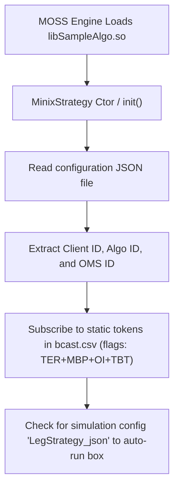
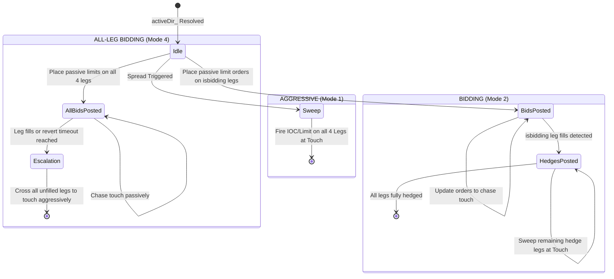

# MOSS Strategy Architecture & Execution Flow Documentation

This document describes the architectural layout, core components, data flows, order execution logic, and spread calculations implemented in the `SampleAlgo` strategy shared library.

---

## 1. System Components & Architecture

The strategy library exposes the strategy dynamic loading hooks (`create` / `destroy`) to the main execution engine. It relies on a modular architecture consisting of the following key files:

| Component / File | Purpose |
| :--- | :--- |
| **[AlgoBase.hpp](file:///home/vikram.lodhi@corp.merillife.com/Projects/ConvexStrategy/vendor/minix/include/AlgoBase.hpp)** | The base interface class provided by the platform. Defines tick, order response, broadcast, and UI event hooks. |
| **[MinixStrategy.hpp](file:///home/vikram.lodhi@corp.merillife.com/Projects/ConvexStrategy/Convex/MinixStrategy.hpp)** / **[MinixStrategy.cpp](file:///home/vikram.lodhi@corp.merillife.com/Projects/ConvexStrategy/Convex/MinixStrategy.cpp)** | The dynamic entry-point and central orchestrator. Reassembles front-end configuration messages, handles the lifecycle of multiple box strategies, and routes market ticks/order responses. |
| **[BoxSpreadStrategy.hpp](file:///home/vikram.lodhi@corp.merillife.com/Projects/ConvexStrategy/Convex/BoxSpread/BoxSpreadStrategy.hpp)** / **[BoxSpreadStrategy.cpp](file:///home/vikram.lodhi@corp.merillife.com/Projects/ConvexStrategy/Convex/BoxSpread/BoxSpreadStrategy.cpp)** | A concrete implementation of a 4-leg option box spread strategy. Contains the math for real-time spreads, execution state machines, and EOD square-offs. |
| **[order_instance.hpp](file:///home/vikram.lodhi@corp.merillife.com/Projects/ConvexStrategy/vendor/minix/include/order_instance.hpp)** / **[order_instance.cpp](file:///home/vikram.lodhi@corp.merillife.com/Projects/ConvexStrategy/vendor/minix/src/order_instance.cpp)** | Convenience wrapper around the raw OMS order lifecycle, transitioning orders through placement, exchange confirmation, modification, and cancellation. |
| **[PortfolioOrderManager.hpp](file:///home/vikram.lodhi@corp.merillife.com/Projects/ConvexStrategy/vendor/minix/include/PortfolioOrderManager.hpp)** / **[PortfolioOrderManager.cpp](file:///home/vikram.lodhi@corp.merillife.com/Projects/ConvexStrategy/vendor/minix/src/PortfolioOrderManager.cpp)** | A lightweight position bookkeeper. Processes order responses, keeps track of net token positions, and aggregates realized/unrealized PnL. |
| **[ProductInfo.hpp](file:///home/vikram.lodhi@corp.merillife.com/Projects/ConvexStrategy/vendor/minix/include/ProductInfo.hpp)** | Contains definitions for snapshot flags, option types, and the `product_data` market snapshot struct. |
| **[oms_api.hpp](file:///home/vikram.lodhi@corp.merillife.com/Projects/ConvexStrategy/vendor/minix/include/oms_api.hpp)** | Defines transaction codes, error codes, request statuses, order sides, types, and body structures used to interface with the OMS. |

---

## 2. Dynamic Lifecycle & Initial Setup



### Configuration & Subscription Setup
* In the constructor of **[MinixStrategy](file:///home/vikram.lodhi@corp.merillife.com/Projects/ConvexStrategy/Convex/MinixStrategy.cpp)**, the strategy pulls configuration parameter paths via `get_strategy_config_file()`.
* It registers itself for market data events on the symbols configured in `bcast.csv` using the subscription flags:
  * `TER_UPDATE_EVENT` (Trade Execution Range)
  * `MBP_UPDATE_EVENT` (Market By Price / Snapshot Depth)
  * `OI_UPDATE_EVENT` (Open Interest Updates)
  * `TBT_UPDATE_EVENT` (Tick-By-Tick Data Updates)

---

## 3. UI Communication & Message Reassembly

Communication with the front-end graphical interface requires a reassembly layer to circumvent message size limits.

### A. Reassembling Incoming Strategy Config (From GUI to Strategy)
1. The GUI connector pushes data to `onUIRequest()` using message codes `9612`, `9620`, or `9621`.
2. The first packet received is a **Metadata Packet** structured as a JSON string detailing the `packet_count` (N chunks).
3. The next N packets contain **Data Chunks** (1500 bytes each).
4. `MinixStrategy` concatenates these chunks in `JsonReassembly::buf`. Once the accumulated chunk count equals the expected total, it forwards the complete JSON string to `applyLegStrategyJson()`.

### B. Translating JSON Parameters & Handling Actions
`applyLegStrategyJson` translates the human-facing GUI parameters to the canonical wire structure. It performs the following action dispatches:

* **`add` / `edit`**: Instantiates or updates a `BoxSpreadStrategy` map entry matching the `strategynumber`.
* **`start`**: Subscribes to the underlying legs (if not subscribed) and turns on the execution flag (`running_ = true`).
* **`stop`**: Halts trading, cancels outstanding orders, and triggers immediate square-offs for any open positions.
* **`delete`**: Stops the target strategy, unsubscribes the relevant tokens, deallocates the strategy object, and purges references.

### C. Sending Updates Back (From Strategy to GUI)
Every ~1 second, the engine’s `doWork()` loop calls `sendStrategySpreadsToUI()`. It sends binary POD structs directly to the UI (Trade Tracker pattern):
1. **Strategy Spread & PnL Updates** (`StrategySpreadUpdate`): Dispatched on message code `100002` via single `memcpy` into `UIStruct::message`. Contains strategy ID, 4-byte `StrategyStatus` enum (`StrategyStatus_INACTIVE = 0`, `StrategyStatus_ACTIVE = 1`, `StrategyStatus_APPLIED = 2`), spread metrics (`BCmp`, `SCmp`, `FLP`, `Gap`), execution metrics (`B-TrQ`, `S-TrQ`), and PnL (`M2M`, `NLP`, `RLP`, `CLP`, `B-ATP`, `S-ATP`).
2. **Strategy Lifecycle Status Updates** (`StrategyStatusUpdate`): Dispatched on message code `100001` via single `memcpy` into `UIStruct::message` for state transitions (`StrategyStatus` enum).
3. Zero JSON serialization, chunking, or heap allocations are used. Total `StrategySpreadUpdate` payload is 64 bytes.

---

## 4. Market Data Event Processing

The strategy updates its cached order books and performs calculations when a tick or broadcast is received:

```mermaid
sequenceDiagram
    participant Engine as Platform Engine
    participant Hub as MinixStrategy
    participant Box as BoxSpreadStrategy
    
    rect rgb(240, 240, 240)
        Note over Engine, Box: Tick Data Stream (High Frequency)
        Engine->>Hub: OnTick(Quote)
        Hub->>Hub: Extract Exchange/Event Timestamp
        Hub->>Hub: Update Monotonic Clock (lastTickTs_)
        Hub->>Box: onTick(Quote, lastTickTs_)
        Box->>Box: Copy Ask/Bid Prices into contiguous Leg arrays
        Box->>Box: run(event_token, nowTs)
    end
    
    rect rgb(230, 245, 230)
        Note over Engine, Box: Broadcast Snapshots (Coarse Frequency)
        Engine->>Hub: onBcastData(product_data)
        Hub->>Hub: Decode LastTradeTime (NSE 1980 epoch -> Unix)
        Hub->>Hub: Update Monotonic Clock (lastTickTs_)
        Hub->>Box: onBcast(product_data, lastTickTs_)
        Box->>Box: Refresh Top-5 Leg arrays from snapshot MBP
        Box->>Box: run(pd.product_id_, nowTs)
    end
```

> [!NOTE]
> The box strategy decouples real-time spread calculations from the clock. The Monotonic Clock (`lastTickTs_`) is only used to evaluate relative timeouts (e.g., bidding escalations and EOD square-offs).

---

## 5. Box Spread Mathematics

A box spread strategy utilizes four options contracts consisting of two strikes: a lower strike $K_1$ and a higher strike $K_2$.

### Arbitrage Edge Calculations (Paise)
When all four roles ($Call_{K1}$, $Put_{K1}$, $Call_{K2}$, $Put_{K2}$) are successfully mapped, the box computes canonical spreads:

* **Net Debit** (The premium cost required to purchase the box):
  $$\text{NetDebit} = Call_{K1}.\text{Ask} - Put_{K1}.\text{Bid} - Call_{K2}.\text{Bid} + Put_{K2}.\text{Ask}$$

* **Net Credit** (The premium revenue received when selling the box):
  $$\text{NetCredit} = Call_{K1}.\text{Bid} - Put_{K1}.\text{Ask} - Call_{K2}.\text{Ask} + Put_{K2}.\text{Bid}$$

* **BCmp (Market Buy Spread Edge)**:
  $$\text{BCmp} = \text{Gap} - \text{NetDebit}$$
  * A positive BCmp value represents an arbitrage profit when buying the box structure.

* **SCmp (Market Sell Spread Edge)**:
  $$\text{SCmp} = \text{NetCredit} - \text{Gap}$$
  * A positive SCmp value represents an arbitrage profit when selling/reversing the box structure.

> [!IMPORTANT]
> Options prices are multiplied by $100$ to operate strictly in paise. The $\text{Gap}$ is computed as:
> $$\text{Gap} = (K_2 - K_1) \times 100 \times \text{boxRatio}$$

---

## 6. Execution Schemes & State Machines

When a buy ($\text{BCmp} \ge B\text{-}Pr$) or sell ($\text{SCmp} \le S\text{-}Pr$) threshold is crossed, the strategy locks the trade direction and initiates execution based on one of three modes:



---

## 7. Order Lifecycle & Position Tracking

Orders are wrapper-tracked to handle confirmations and avoid latency issues:

1. **State Machine (`order_instance`)**:
   Tracks transition stages: `STRAT_INITIAL_STATE` $\rightarrow$ `STRAT_ORDER_PLACED` $\rightarrow$ `STRAT_OMS_PLACED` $\rightarrow$ `STRAT_EXCHG_CONF`. 
   It ensures no modification (`update_order`) or cancellation (`cancel_order`) is dispatched while another response is pending (`is_response_pending()`).

2. **Trades & Portfolio Management (`PortfolioOrderManager`)**:
   * Listens to the `OMS_TRADE` event code (`6666`).
   * When a fill is verified, it updates net positions (`net_qty`) and registers the transaction details.
   * Cashflow adjustments are made based on the effective trade side:
     $$\text{CashFlow} = \text{CashFlow} + (\text{Sign}_{\text{Side}} \times \text{Price} \times \text{Qty})$$
   * Evaluates rolling realized PnL and updates mark prices on snap updates to reflect unrealized exposure.

3. **Transaction Costs**:
   Applied per fill on option traded values in paise:
   * **Buy transactions**: $60$ Paise per Rs. $10,000$ value ($6,000$ Rs per Crore)
   * **Sell transactions**: $70$ Paise per Rs. $10,000$ value ($7,000$ Rs per Crore)

---

## 8. End-of-Day (EOD) Operations

To prevent overnight option exposure, the system executes square-off safety protocols:

* **Time Anchor**: The strategy anchors the first tick with a valid exchange clock as the market open (representing `09:15:00`).
* **Cutoff Marker**: It sets a target expiration timestamp (`eodTs_`) equivalent to the open timestamp plus a fixed offset of 22,440 seconds (corresponding to `15:29:00`).
* **Liquidation Trigger**: When the exchange clock matches or exceeds `eodTs_`, the active execution cycle stops. It calls `squareOffLeg()` on each leg, which issues aggressive limit orders to close out remaining net positions (`signedPos`).

---

---

## 9. Ratio N-Leg (2-Leg to 6-Leg) Strategy Mathematics

Ratio spread strategies operate on 2 to 6 legs where each leg is weighted by a per-leg ratio multiplier.

### Real-Time Spread Calculations (Paise)
* **Ratio Multipliers**: Leg ratios are parsed from the `"Ratio"` object (`"LegRatios"` array) in the JSON configuration.
* **Spread formula**:
  $$\text{Spread} = \sum_{i=0}^{N-1} \text{SideSign}_i \times \text{Price}_i \times \text{Ratio}_i$$
  * Where $\text{SideSign}_i = -1$ if the execution side of the leg is `BUY_SIDE` and $+1$ if it is `SELL_SIDE`.
  * For buying a spread (BCmp), the leg prices are evaluated at their ask prices for BUY sides, and bid prices for SELL sides. For selling a spread (SCmp), the leg prices are evaluated at their bid prices for BUY sides, and ask prices for SELL sides.

### Quantity & Slippage Scaling
* **Pack Definition**: Frontend "1 Lot" equals 1 complete ratio pack across all legs.
  * Total Bidding Lots: $\text{totalBiddingLots} = \text{param\_.\_totalQuantity (packs)} \times \text{\_ratios}[\text{\_biddingLeg}]$.
  * Bidding Leg Slice Size: `param_._quantity * _ratios[_biddingLeg] * _lotSize`.
  * Partial Fill Remainder Clamping: When partial fills occur on `_biddingLeg`, order size is clamped to `(biddingRatio - (tradedLot % biddingRatio)) * lotSize` to complete the in-flight pack without overfilling.
  * Hedge Leg Target Lots: `biddingPacks * _ratios[leg]` where `biddingPacks = tradedLot[_biddingLeg] / _ratios[_biddingLeg]`.
* **Traded Pack Calculation**: $\text{totalPacks} = \min_{i=0}^{N-1} (\text{\_tradedLot}[i] / \text{\_ratios}[i])$.
* **Slippage Calculation**: Accumulated slippage per leg is scaled by its corresponding ratio: $\text{slippage} = \frac{\text{param\_.\_spread} - \text{AdjustGap}(\text{tradedSpread})}{100.0}$.

### Dynamic Bidding & Multi-Stage Hedging Flow
1. **Bidding Phase**: Quoting on `_biddingLeg` occurs passively based on market depth, user target spread (`param_._spread`), and pack-remainder boundaries.
2. **Hedge Priority Guard**: In `OnTick` and on trade confirmations, if any ratio mismatch (`_isUnhedged`) is detected, the bidding leg is cancelled immediately, and hedge orders are serviced with top priority.
3. **Phase 1 Hedging (Stored Snapshot Price with Per-Retry Tick Step Escalation)**:
   - Upon first leg fill (`_biddingLeg`), hedge legs are placed at stored market price snapshot `_windRate._price[leg]` offset by `_tradeGear` aggressive ticks.
   - On each modification attempt $k < \text{\_marketOrderRetries}$, price steps aggressively by 1 tick:
     - **BUY side**: $P_{\text{target}} = P_{\text{base}} + (\text{\_tradeGearPriceOffset} + k \times \text{TickSize})$
     - **SELL side**: $P_{\text{target}} = P_{\text{base}} - (\text{\_tradeGearPriceOffset} + k \times \text{TickSize})$
4. **Phase 2 Hedging (Aggressive Opposite Side Touch Execution)**:
   - When `_marketOrderRetries == 0` or retry count reaches `_marketOrderRetries`, the order aggressively crosses the spread to the opposite touch (BUY at Ask, SELL at Bid) to guarantee fill and complete the trade. Stoppage is governed solely by `AllowedSlippage`.
   - While an OMS response is in flight (`is_response_pending()`), order modifications and retry increments are strictly suppressed.

---

> [!WARNING]
> If market data books are crossed ($\text{Bid} \ge \text{Ask}$), the strategy blocks trading updates (`booksReady()` returns false). This prevents the algorithm from executing trades on stale, single-sided, or invalid market feeds.

