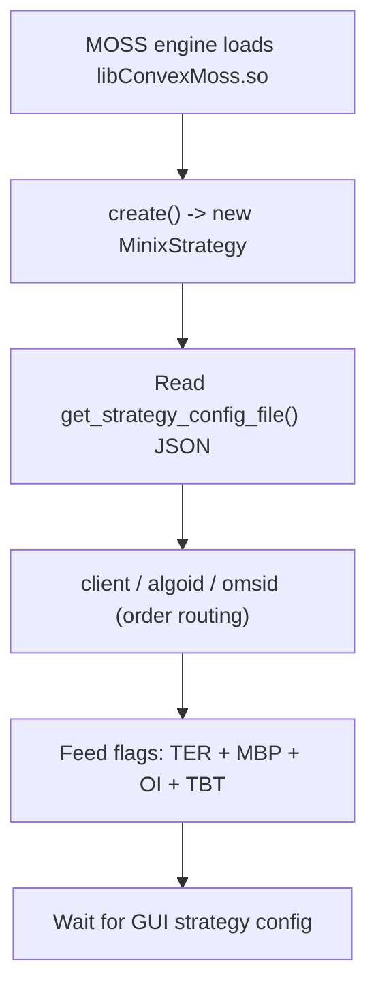
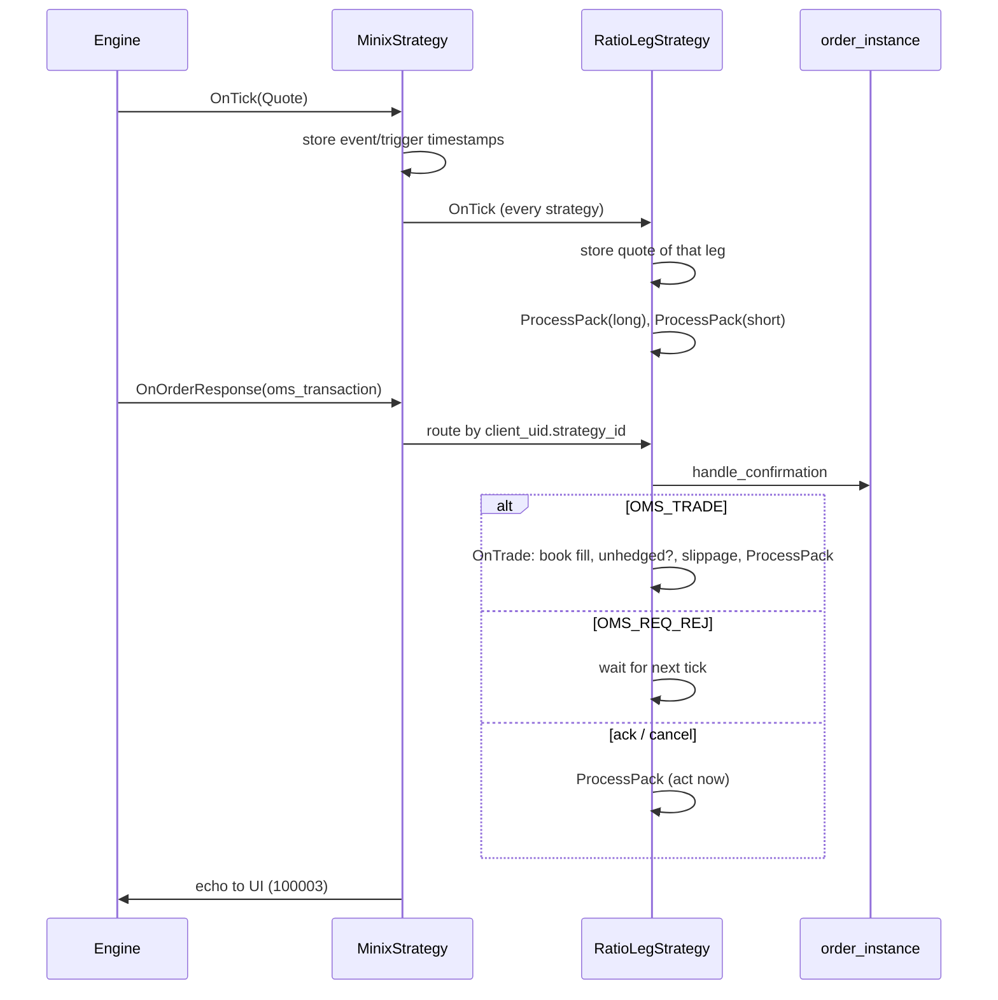
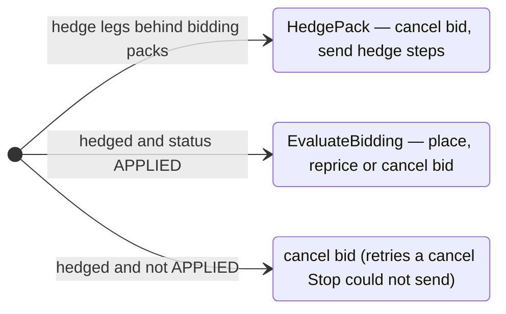

# ConvexStrategy — Architecture & Execution Flow

This document describes how the `libConvexMoss.so` strategy library is put together, how events move through it, and the order execution rules of the ratio strategy. Parameter details are in [strategy_parameters.md](strategy_parameters.md); the UI wire format is in [UI_BINARY_PROTOCOL_SPEC.md](UI_BINARY_PROTOCOL_SPEC.md).

All prices and values are **paise**. The engine is single-threaded: `OnTick`, `OnOrderResponse`, `doWork` and `onUIRequest` never run concurrently.

---

## 1. Components

| Component | Purpose |
| :--- | :--- |
| [`Convex/MinixStrategy.hpp/.cpp`](Convex/MinixStrategy.cpp) | Entry point (`create` / `destroy`) and hub. Reassembles GUI config, owns the strategies (`std::map<uint32_t, std::unique_ptr<RatioLegStrategy>>`), fans out ticks and order responses, places/modifies orders (`UpdateOrder`), and echoes state to the UI (`SendToUi`). |
| [`Convex/RatioLeg/RatioLegStrategy.hpp/.cpp`](Convex/RatioLeg/RatioLegStrategy.cpp) | One N-leg ratio spread (2..6 legs). Leg 0 bids passively; the other legs hedge. Runs a long pack and a short pack independently. |
| [`Convex/Utils.hpp`](Convex/Utils.hpp) | Cost constants, `StrategyStatus`, `UiMessageCode`, packed UI wire structs (size-checked with `static_assert`). |
| [`vendor/minix/.../order_instance`](vendor/minix/src/order_instance.cpp) | Vendor wrapper of one order's OMS lifecycle. Read-only. |
| [`vendor/minix/include/AlgoBase.hpp`](vendor/minix/include/AlgoBase.hpp) | Platform base class (feeds, product details, `send_order`, `sentoUI`, logging). Implemented in `lib/libAlgoBase.so`. |
| [`tests/ratio_dry_run.cpp`](tests/ratio_dry_run.cpp) | Dry run: real strategy code against a fake `AlgoBase` and a mini exchange. |

---

## 2. Start-up

No tokens are subscribed at start-up. Each strategy subscribes its own legs when it is created.

---

## 3. GUI → Strategy: config intake

1. The GUI sends on message code `100001` (`UiMessageCode_STRATEGY_CONFIG`) a metadata packet `{"packet_count":N,...}` zero-padded to 1500 B, then N raw 1500 B slices of the strategy JSON.
2. `onUIRequest` strips trailing NUL bytes, appends the slices, and after N slices calls `ApplyLegStrategyJson`.
3. `ApplyLegStrategyJson` maps `Strategy.SubType` to a leg count and gap rule:

| SubType | Legs | Strike gap in spread |
| :--- | :--- | :--- |
| `2LegRatio` .. `6LegRatio` | 2..6 | no |
| `Butterfly` | 3 | no |
| `Box` | 4 | yes |
| `ConRev` | 3 | yes |

4. `HandleRatioLegStrategy` acts on `Strategy.Status` (case-insensitive):

| Status | Action |
| :--- | :--- |
| `SUBSCRIBE(D)`, `ACTIVE` | Create, or `ParamUpdate` an existing strategy; status `ACTIVE` (market data only). |
| `APPLY`, `APPLIED` | Create or update; status `APPLIED` (bidding and hedging). |
| `NEW` | Create or update; status `INACTIVE` via `Stop()`. |
| `UNSUBSCRIBE(D)`, `STOP` | `Stop()`. |
| `DELETE(D)` | `Stop()`, then destroy the strategy. |

5. The UI then receives the strategy's **actual** status on `100001` (`StrategyStatusUpdate`); INACTIVE if creation failed or the strategy was deleted.

**Creation** (`RatioLegStrategy` constructor): open the log file, parse `Legs` (token, side) and `Ratio.LegRatios`, load product details for every leg, apply `Params`, create the orders, then subscribe. If a leg has no product details or a zero lot/tick size, the constructor throws before subscribing and no strategy is stored. Tokens, sides and ratios are fixed at creation; later updates change only `Params`.

---

## 4. Strategy → GUI: echo

| Code | Payload | When |
| :--- | :--- | :--- |
| `100001` | `StrategyStatusUpdate` (8 B) | After each config request. |
| `100002` | `StrategySpreadUpdate` (64 B) | Every ~1 s from `doWork` (`steady_clock`): BCmp, SCmp, cost, FLP, gap, traded packs, M2M, NLP, RLP, CLP, B-ATP, S-ATP. |
| `100003` | `ExternalOrderResponse` | Each placed / modified / cancelled / traded / rejected response. |
| `100004` | `TradeTracer` (55 B) | Each time whole packs complete (slippage report). |

---

## 5. Event flow

The side in a response names the pack: the long and short packs trade opposite sides of every leg.

### The pack decision (`ProcessPack`)

Every tick and every non-reject response runs this decision once per pack. Hedging runs in every status, so a stopped strategy still goes flat.

---

## 6. Spread & bidding

**Spread** of a pack at the crossing side of the book (`QuoteSpread`):

$$\text{Spread} = \text{AdjustGap}\Big(\sum_{i=0}^{N-1} \text{SideSign}_i \times \text{Price}_i \times \text{Ratio}_i\Big)$$

* $\text{SideSign}_i = -1$ for a BUY leg, $+1$ for a SELL leg (net-credit convention).
* $\text{Price}_i$ is taken from the side a crossing order would take (`_takeSide`): ask for a BUY leg, bid for a SELL leg.
* Any missing leg price makes the spread invalid (reported as 0).
* With a strike gap (Box, ConRev): $\text{AdjustGap}(s) = s + \text{gap}$ if $s < 0$, else $s - \text{gap}$, where gap = |strike₀ − strike₁|.
* BCmp is the long pack's spread, SCmp the short pack's.

**Entry** (`EvaluateBidding`), in this order; any failure cancels the bid:

1. Lots left: $\text{remaining} = \text{\_totalPacks} \times \text{Ratio}_0 - \text{tradedLots}_0 > 0$.
2. Hedge-leg depth on the side each hedge takes: `OrderDepth` levels with orders, `PriceDepth` levels with prices, and at least `_requiredHedgeDepth` quantity in the first `OrderDepth` levels.
3. Bidding-leg depth: `AllowedBidDepth` priced levels on its own side.
4. Valid spread and $\text{Spread} \ge \text{\_targetSpread}$.

**Order** on leg 0, resting at its own side's touch (BUY at bid, SELL at ask):

* A partly filled pack is finished first: $\text{orderLots} = \text{Ratio}_0 - (\text{tradedLots}_0 \bmod \text{Ratio}_0)$ when the remainder is non-zero, else $\text{\_slicePacks} \times \text{Ratio}_0$.
* $\text{quantity} = \min(\text{orderLots}, \text{remaining}) \times \text{lotSize}$.
* Repriced only when the touch moved by at least `_repriceThreshold` (`TickSize` param × tick size).
* Each successful send stores the leg prices in `_bidSnapshot`; hedges start from them.

---

## 7. Hedging

A pack is **unhedged** when any hedge leg holds fewer lots than the completed bidding packs need:

$$\text{biddingPacks} = \lfloor \text{tradedLots}_0 / \text{Ratio}_0 \rfloor, \qquad \text{unhedged} \iff \exists\, i > 0: \text{tradedLots}_i < \text{biddingPacks} \times \text{Ratio}_i$$

While unhedged, `HedgePack` cancels the bid and, per hedge leg (`ExecuteHedgeLeg`):

* $\text{missing} = \text{biddingPacks} \times \text{Ratio}_i - \text{tradedLots}_i$; nothing to do when $\le 0$.
* $\text{quantity} = \min(\text{missing} \times \text{lotSize}, \text{sliceQuantity}_i)$.
* Aggressive when `MarketRetries == 0` or retries ≥ `MarketRetries`.
* Base price: the opposite touch when aggressive (or no snapshot), else `_bidSnapshot._price[i]`. An empty opposite side waits for a real price.
* $\text{price} = \max(\text{base} + \text{sign} \times (\text{\_tradeGearOffset} + \text{retryOffset}),\ \text{tickSize})$, sign $+1$ BUY / $-1$ SELL, retryOffset = retries × tick when not aggressive.
* A retry is one request actually sent. Retry counts reset when the pack becomes hedged.

---

## 8. Orders

`order_instance` (vendor) tracks `STRAT_INITIAL_STATE → ORDER_PLACED → OMS_PLACED → EXCHG_CONF`, with modify and cancel bits. A fully traded or cancelled order resets to the initial state.

`MinixStrategy::UpdateOrder(order, price, quantity, clientUid)` is the only place/modify path. It returns the uid when a request was sent, else 0:

* Nothing is sent for `quantity <= 0`, `price <= 0`, or while a response is pending.
* Initial state: place with the next `request_id`. `request_id` is a 22-bit field that starts at 0 per strategy and stops at `MAX_REQUEST_ID` (logged once) instead of wrapping.
* Otherwise: modify only a confirmed order whose price or open quantity differs. `quantity` is the open quantity wanted; the vendor adds the filled quantity back.

`CancelOrder` (strategy) cancels only a confirmed order with no pending response. Both guards exist because the vendor logs every request it refuses, and these paths run on every tick.

---

## 9. Fills, slippage and PnL

`OnTrade` books lots and value per leg in `_tradedLots` / `_tradedValue` and in `_unreportedLots` / `_unreportedValue`. When the pack is hedged after a fill:

* `_tradedSpread` (B-ATP / S-ATP) is refreshed from average leg prices.
* `CheckSlippageThreshold` reports every newly completed pack: traded spread of those packs, slippage = (target − traded) / 100 rupees, a `TradeTracer` to the UI, and `Stop()` when `AllowedSlippage > 0` and slippage exceeds it. Lots beyond the reported packs carry to the next report at their average value.

| Figure | Formula |
| :--- | :--- |
| Traded packs (B-TrQ / S-TrQ) | $\min_i \lfloor \text{tradedLots}_i / \text{Ratio}_i \rfloor$ |
| RLP | $\sum_i \min(\text{buyQty}_i, \text{sellQty}_i) \times (\text{avgSell}_i - \text{avgBuy}_i) - \text{costs}$, across both packs |
| M2M | $\sum_i \text{netQty}_i \times (\text{mark}_i - \text{avg}_i)$; mark = bid when long, ask when short; empty side skipped |
| NLP | RLP + M2M |
| Cost | $\sum_i \text{Ratio}_i \times (\text{bid}_i \times \text{buyRate}_i + \text{ask}_i \times \text{sellRate}_i)$ at the current touch |

Cost rates are in `Utils.hpp` (`OptionBuyCost`, `OptionSellCost`, `FutureBuyCost`, `FutureSellCost`), as fractions of traded value.

---

## 10. Stop and delete

* `Stop()` sets INACTIVE and cancels bidding orders. An unhedged pack keeps its hedge orders working (ticks and responses) until flat, so stopping never leaves a naked leg. A cancel refused because the bid was still unacknowledged is retried by `ProcessPack` on the next event.
* Delete calls `Stop()` and destroys the strategy at once. Products stay subscribed. Deleting while unhedged is the user's responsibility.

---

## 11. Logging

Each strategy writes `log/<YYYYMMDD>/<N>Ratio_<id>_<HHMMSS>.log`, line-buffered, every line prefixed with local time `HH:MM:SS.uuuuuu`. Lines are written on events and state changes only; an idle tick writes nothing (the dry run asserts this).

| Tag | When | Key fields |
| :--- | :--- | :--- |
| `[INIT]`, `[nLegRatios]`, `Params parsed`, `updateSideCache` | Creation and each param update | Tokens, sides, ratios, lot/tick, every param, slice sizes |
| `[RatioLeg:SetStatus]`, `[RatioLeg:Stop]` | Status change | New status; Stop reason (`GUI STOP`, `GUI DELETE`, `status INACTIVE requested`, `slippage above AllowedSlippage`) and per-leg lots |
| `[BID-GATE]` | The reason the bid is (not) quoting changes | `OLD -> NEW` (`OPEN`, `DONE`, `HEDGE_DEPTH`, `BID_DEPTH`, `NO_PRICE`, `BELOW_TARGET`), target vs market spread, lots, touch of every leg; for `HEDGE_DEPTH` the thin leg and which check failed |
| `[ORDER-OUT]` | Every place, modify and cancel actually sent | Pack, leg, token, side, `PLACE`/`MODIFY`/`CANCEL`, uid, `old->new` price and qty, then `BID` (target, market) or `HEDGE` (mode, retry, base price, missing lots) or the cancel reason |
| `[ORDER-IN]` | Every OMS response | Transaction name and code, uid, price, qty, `err=header/reason/exchange`, and the order state it left (`state` bitmask, open qty@price, filled, live uid) |
| `[TRADE EVENT]` | Every fill | Leg, side, price, qty, pack, lots per leg as `traded/needed` |
| `[PACK]` | Pack turns `UNHEDGED` or `HEDGED` | Lots per leg, completed packs |
| `[HEDGE]` | A hedge leg starts waiting for an opposite price | Leg, missing lots, book |
| `[SLIPPAGE]`, `Tracer` | Whole packs complete | Average leg prices, traded spread, slippage |

`state` is the vendor `STRAT_ORDER_STATE` bitmask: `0x1` placed, `0x2` OMS ack, `0x4` exchange confirmed, `0x8` modify sent, `0x10` modify ack, `0x20` cancel sent; `0x0` means no live order.

Hub-level events (config JSON received, strategy created/updated/stopped/deleted, responses for unknown strategies, `request_id` limit) go to stdout.

## 12. Dry run

`tests/ratio_dry_run.cpp` links the real `MinixStrategy`, `RatioLegStrategy` and vendor `order_instance` against a fake `AlgoBase` and a mini exchange (acks, modifies, cancels, crossing fills, rejected late cancels/modifies). The build command is in the file header. Scenarios: full bid/fill/hedge cycle, STOP racing an unacknowledged bid, STOP while unhedged, unknown token, per-pack retry reset, and idle-tick log volume.
